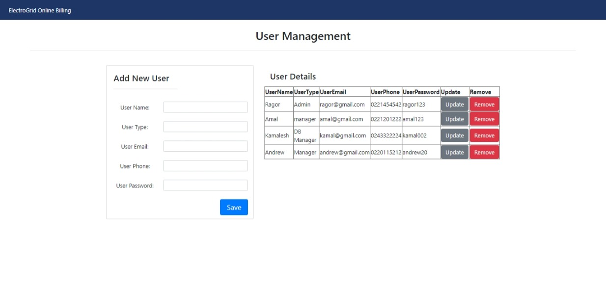

# ElectroGrid-ClientSide
## User Management Service

 

# About the Project

This project is based on an Electro Grid (EG) is the company who maintains the power grid of the country online platform. I have implemented User management functions in this system.

#  The Technologies,
-  java JAX-RS(jersy) Restful web service  
-  Apache Tomcat  
-  Mysql as the database 
-  Eclipse IDE.

#  Link To GadgetBadget_clientside Database

#  Developer

Wijewickrama G.R.P.S - IT20168018

# Screenshot of the UI

