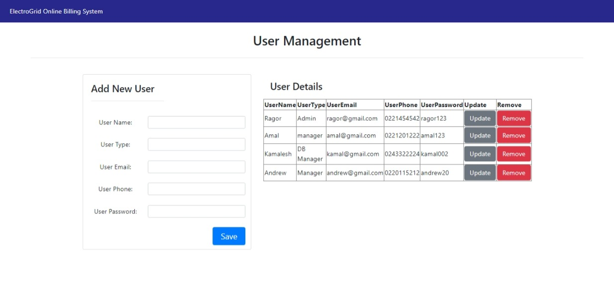

# ElectroGrid-ClientSide
## User Management Service

 

# About the Project

This project is based on an Electro Grid (EG) is the company who maintains the power grid of the country online platform. They have a system to monitor the power consumption of the users, generate the monthly bills and automatically send to the users, and accept the online payments from the users. The aim of this project is to develop a rich front-end for the online platform. I have implemented User management functions in this system.

#  The Technologies,
-  java JAX-RS(jersy) Restful web service  
-  Apache Tomcat  
-  Mysql as the database 
-  Eclipse IDE
-  Client-components: JQuery, Ajax for DC
-  View: HTML,CSS,Bootstrap(optional)

#  Link To ElectroGrid-clientside Database

https://github.com/pasinduni/ElectroGrid-ClientSide/blob/main/Database/user.sql

#  Developer

Wijewickrama G.R.P.S - IT20168018

# Screenshot of the UI

View user details

Insert, Update, Delete user details

